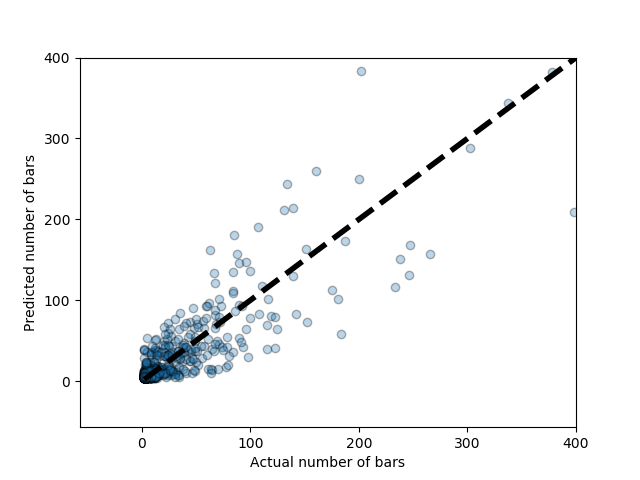

# 
Should I Open a Bar?

 Capstone project, Denver Cohort 8 
Ariel "Ari" Libertun
 

The question about whether to start a business is one that many people can relate to and that is what motivated me to use it for my capstone. In this project we use a machine learning technique, combined with publicly available data from the US Census Bureau to provide a basic market analysis and a friendly way to access it.

The result of this project is a proof-of-concept web app for people that like a data driven business decision making approach.

## Table of Contents
1. [Understanding the problem](#Understanding-the-problem)
2. [The data](#the-data)
3. [Model and features](#model-and-features)
4. [The results](#the-results)
5. [The final product](#the_final_product)
6. [Future Directions and refinements](#future-directions-and-refinements)
4. [Some useful references and resources](#some-useful-references-and-resources)
    * [Sources of the data used](#sources-of-the-data-used)
    * [Useful articles](#useful-articles)
6. [Folder structure and list of files](#folder-structure-and-list-of-files)
7. [Technology Stack](technology-stack)

## Understanding the problem
A bar belong to a class of business where location is important, it is not possible to e-commerce the bar experience. Because of that, the number of bars that a particular market can support must be mostly dependent on local characteristics, such as population, average income, etc. When choosing the kind of location to base this study, I looked for a location category with enough cases and variation, and at the same time with some sort of similarity or common denominators. US counties satisfied these conditions, as it will be shown later in the EDA section. 
One other thing necessary to address the problem was to select the right features. For this project we selected six: 
* area
* population
* population density
* household median income
* number of liquor stores
* number of hotels

The reason to include the number of hotels as a feature is for it to be a proxy of the travelers visiting a county. The patrons of a bar are the local population and as well as the visitors.

  

## The Data
All the data was obtained from the US Census Bureau Website, in particular through their Fact Finder interface. We used information from 2015, as that was the most recent year where we could find all the variables we needed. All downloaded data was processed, formated as a panda data frame and saved as a csv file to be used in the analysis and model choosing performed later. The python code is in src/data_processing.py and the csv file with all data and features is in data/2015_master_sd_rnd_nan_to_min.csv.

Using geographic, demographic and economic information at the county level to train a machine learning model presents some attractive advantages, one of them being its diversity. As part of an initial exploratory data analysis (EDA), I plotted histograms with areas, population and population densities. When linear scales are used for the horizontal axis, the presences of very large cases prevent the visualization of the actual distribution, as can be appreciated in figure 1.

<b>Figure 1: </b> Histograms of area, population and population density on linear horizontal axis

To really appreciate the distribution of these characteristics it is useful to transform the horizontal axis into a log10 scale, that is to plot histograms of the log10 quantity instead of the quantity itself. The results can be seen in figure 2. The advantage of the log10 transformation, as opposed to some other log, is the interpretability of the numbers shown on the horizontal axis, they indicate the actual number for zeros, or order of magnitude, of the quantity.

<b>Figure 2: </b> Histograms of area, population and population density on a log10 horizontal axis

## Model and features
To select the best model to use counties were randomly separated in a train and test subsets on a 70% to 30% proportion. The models explored where linear regression, linear regression with Ridge regularization, single tree regressor and random forest regressor. They were evaluated on the explained variance score with the following results:
- linear regression
  - training: 0.81
  - testing: 0.69
- linear regression with Ridge regularization
  - training: 0.81
  - testing: 0.69
- single tree regressor (maximum depth of 6)
  - training: 0.94
  - testing: 0.70
- random forest regressor (20 estimators and maximum depth of 6)
  - training: 0.93
  - testing: 0.84

The model finally chosen was the Random Forest Regressor with 20 estimators and maximum depth of 6, for its highest score in testing and for not predicting negative number of bars. The order of the feature importance and their relative importance as returned by the feature_importances method are: 
1. Population: 0.62
2. Hotels: 0.23
3. Liquor Stores: 0.05
4. Pop. Density: 0.04
5. Household Median Income: 0.04
6. Area: 0.02

## The results

The results of this model are shown in figure 3. It is presented in the form of a scatter plot, with the vertical axes representing the model prediction and the horizontal the actual number of bars.

<b>Figure 3: </b> Scatter plot of the predicted number of plots as a function of the actual number of bars
 

In this representation, the counties above the 45 degrees line are counties where the model predicts a higher number of bars than actually are, while the ones bellow that line are counties with more bars than predicted. 

## The final product

Presenting the results in the format of figure 3 is very visual and clear, but not easy to use to figure out the situation on any particular county.

To facilitate the usability of these results a I put together a website using flask and a bootstrap template, that at the time of this writing is live running on AWS and that can be accessed at https://goo.gl/sKtXVT. In this web up there is a page explaining the nature of the project, another one that returns a market analysis for a county of the users choice, and page with a ranking of the best and worst counties to open a bar.

## Future Directions

There are two main avenues to continue with this project. The first one is working on the model and the features. Some of the possibilities are:
- Explore different set of features: Population of drinking age, average commute time, etc.
- Keep exploring machine learning techniques  

The second one is to improve the usability of the results. Two options are:
- Tackle other granularities: Zip Codes, cities, urban areas, etc.
- Finding more ways of presenting the data and the results of the model

## Some useful references and resources
### Sources of the data used:
1. US Census Bureau: [https://www.census.gov](https://www.census.gov/)
2. American Community Survey (ACS): [https://www.census.gov/programs-surveys/acs/](https://www.census.gov/programs-surveys/acs/)

#### Useful articles:
1. [Source by OpenNews: <b><i>How to Use the Census Bureau’s American Community Survey like a Pro</i></b>](https://source.opennews.org/articles/how-use-census-bureau-american-community-survey/) by Paul Overberg
2. [TrendCT.org: <b><i>Tutorial: How to understand and retrieve Census data — for beginners</i></b>](https://trendct.org/2015/08/14/tutorial-how-to-understand-and-retrieve-census-data-for-beginners/)  by Alvin Chang

## Folder structure

/src 

data_processing.py: python script that process the data and produces csv files to be used as input for the other codes. 
model_training_and_scoring.py: python script that evaluates the models and returns the model, the dataframe with the information and the list of columns in a pickle format. 
market_analisis.py: a python script with the very first basic and all text version of the market analysis. 
model_and_cols.pkl: pickle file with the slected model, the dataframe with the information and the list of columns.  

/src/jupyter_notebooks 
jupyter notebooks used to generate some of the figures and tables using in this project (names should be self explanatory). 

/web_app 
bars_web_app.py: flask code to run the back end of the Website 
/web_app/static 
All the css files for formatting the Website 
web_app/templates 
All the html templates for the website.

7. [Technology Stack](technology-stack)

<b>Figure 3: </b> Scatter plot of the predicted number of plots as a function of the actual number of bars
 
