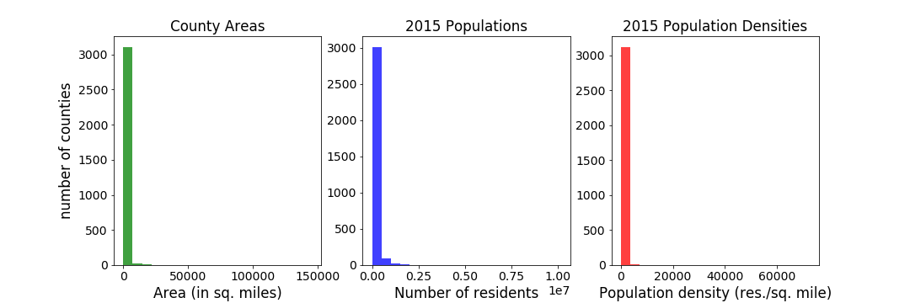
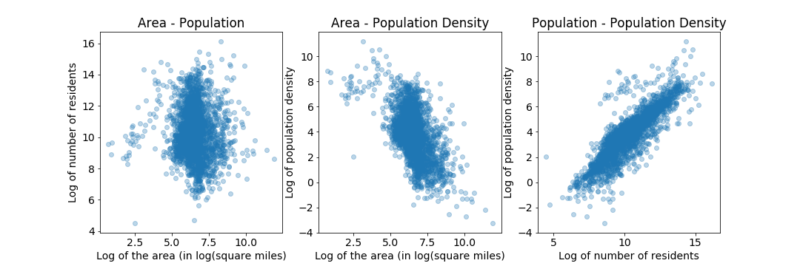

# 
Should I Open a Bar?

 Capstone project, Denver Cohort 8 
Ariel Libertun
 

## Introduction
This project demonstrates one of the powers of data science. It uses a machine learning algorithm, trained with publicly available data produced by the US Census' American Community Survey program, to help answer a question that might be easier to ask than to respond.

## Why this question?
As much as I might be interested in opening a bar, the question is an excuse to show many points of the data science process. Bars belong to a class of business that require the physical presence of the customer and it is not really replaced by any sort of delivery or e-commerce alternative. As such, the number of bars that a particular market can support must be strongly dependent on local features, such as population, average income, etc.  
Those are features, as well as the number of bars among many other, the US Census Bureau provides through their American Community Survey program for everybody to use.

Using geographic, demographic and economic information at the county level to train a machine learning model presents some attractive advantages. One of them is its diversity, with areas, population and population densities that span over many order of magnitude, as it can be seen in the histograms of figure 1.

<b>Figure 4: </b> Histograms of area, population and population density 

An initial analysis of whether is okay to use population, county area, and population density. As it can be seen in the right-most scatter plot of figure 2, the population and the population density are quite correlated.  

<b>Figure 4: </b> Histograms of area, population and population density 

### Some useful references and resources
#### Sources of the data used:
1. US Census Bureau: [https://www.census.gov](https://www.census.gov/)
2. American Community Survey (ACS): [https://www.census.gov/programs-surveys/acs/](https://www.census.gov/programs-surveys/acs/)

#### Useful articles:
1. [Source by OpenNews: <b><i>How to Use the Census Bureau’s American Community Survey like a Pro</i></b>](https://source.opennews.org/articles/how-use-census-bureau-american-community-survey/) by Paul Overberg
2. [TrendCT.org: <b><i>Tutorial: How to understand and retrieve Census data — for beginners</i></b>](https://trendct.org/2015/08/14/tutorial-how-to-understand-and-retrieve-census-data-for-beginners/)  by Alvin Chang
