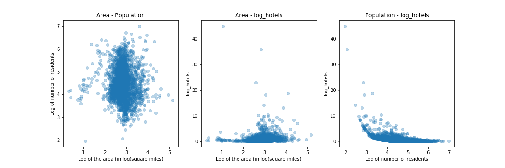

# 
Should I Open a Bar?

 Capstone project, Denver Cohort 8 
Ariel Libertun
 

This project demonstrates one of the powers of data science. It uses a machine learning algorithm, trained with publicly available data produced by the US Census' American Community Survey program, to help answer a question that might be easier to ask than to respond.

## Table of Contents
1. [Why this question?](#why-this-question?)
2. [The Data](#the-data)
3. [Model and features](#model-and-features)
4. [Some useful references and resources](#some-useful-references-and-resources)
    * [Sources of the data used](#sources-of-the-data-used)
    * [Useful articles](#useful-articles)
5. [Future Directions and refinements](#future-directions-and-refinements)

## Why this question?
As much as I might be interested in opening a bar, the question is an excuse to show many points of the data science process. Bars belong to a class of business that require the physical presence of the customer and it is not really replaced by any sort of delivery or e-commerce alternative. As such, the number of bars that a particular market can support must be strongly dependent on local features, such as population, average income, etc.  
Those are features, as well as the number of bars among many other, the US Census Bureau provides through their American Community Survey program for everybody to use.

## The Data
All the data was obtained from the US Census Bureau Website.

Using geographic, demographic and economic information at the county level to train a machine learning model presents some attractive advantages. One of them is its diversity, with areas, population and population densities that span over many order of magnitude, as it can be seen in the histograms of figure 1.

<b>Figure 1: </b> Histograms of area, population and population density 

An initial analysis of whether is okay to use population, county area, and population density. As it can be seen in the right-most scatter plot of figure 2, the population and the population density are quite correlated.  

<b>Figure 2: </b> Histograms of area, population and population density 

Another scatter plot is shown in figure 3.

<b>Figure 3: </b> Histograms of area, population and hotels 

## Model and features
The model used is a Random Forest Regressor with 20 estimators and maximum depth of 3. The order of the feature importance is: 
Population (0.70497742)
Number of hotels (0.25348337)
County Area (0.04153921)

To choose this model in particular, we evaluated the cross correlation score. The values obtained (Train: 0.806, Test: 0.673) where marginally better than the lineal regression and Ridge regression, but we preferred this model because it never returned negative values in its predictions.

## Future Directions and refinements

I have a csv file with a simplified dataset
I have a model running that rather poorly models the number of bars
I have a 1970 style interface that can interact with the user.

<b>Figure 3: </b> Primitive interface showing a prediction of the model 

### List of things to do

#### Website
Update it to current times

#### Readme.md file
Keep improving it. Make it more interestingly and more complete (explain more about the data selection)

Some other features that may be added will be:
median income
switch population for population of drinking age
number of liquor stores

## Some useful references and resources
### Sources of the data used:
1. US Census Bureau: [https://www.census.gov](https://www.census.gov/)
2. American Community Survey (ACS): [https://www.census.gov/programs-surveys/acs/](https://www.census.gov/programs-surveys/acs/)

#### Useful articles:
1. [Source by OpenNews: <b><i>How to Use the Census Bureau’s American Community Survey like a Pro</i></b>](https://source.opennews.org/articles/how-use-census-bureau-american-community-survey/) by Paul Overberg
2. [TrendCT.org: <b><i>Tutorial: How to understand and retrieve Census data — for beginners</i></b>](https://trendct.org/2015/08/14/tutorial-how-to-understand-and-retrieve-census-data-for-beginners/)  by Alvin Chang
